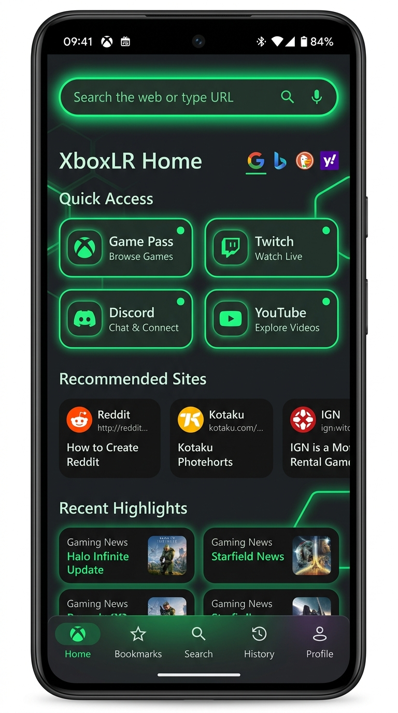
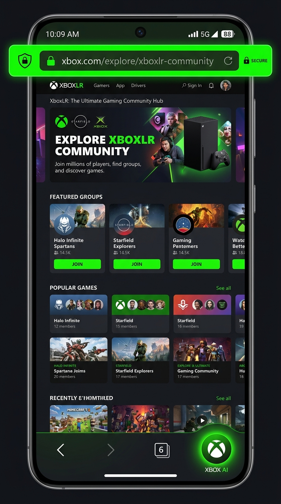
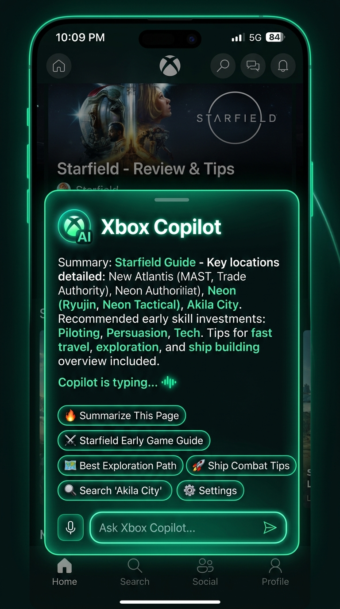
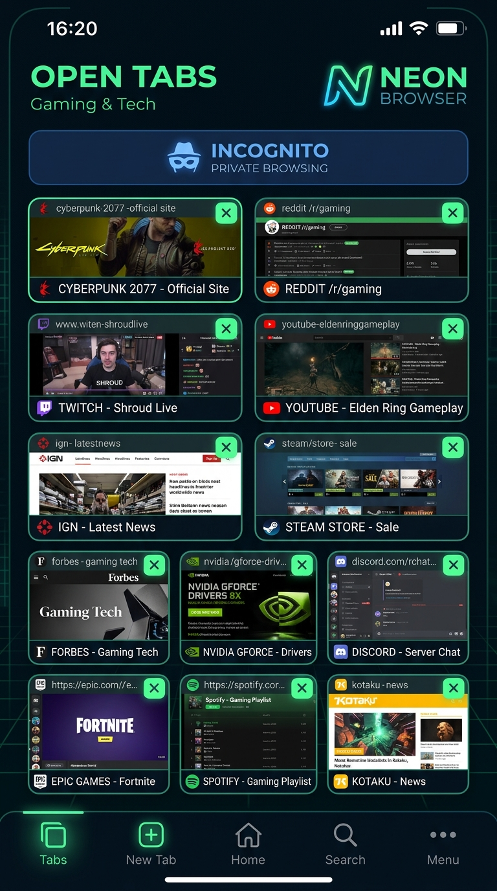
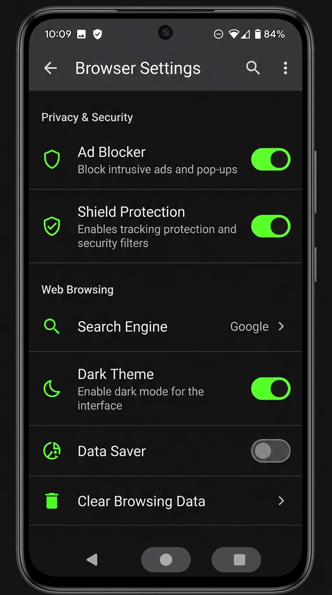

<p align="center">
  
</p>

<h1 align="center">XboxLR Browser</h1>

<p align="center">
  <b>Navegador web moderno, ultrarrápido y seguro para Android, con estética gaming inspirada en el ecosistema Xbox y potenciado por Inteligencia Artificial con Google Gemini.</b>
</p>

<p align="center">
  <a href="https://github.com/luismiguel38338-cmd"></a>
  
  
  
  
  
</p>

---

## 📌 Tabla de Contenidos

1. [Descripción General](#-descripción-general)
2. [Capturas de Pantalla](#-capturas-de-pantalla)
3. [Características Principales](#-características-principales)
4. [Funciones de Navegación](#-funciones-de-navegación)
5. [Inteligencia Artificial (Xbox IA Copilot)](#-inteligencia-artificial-xbox-ia-copilot)
6. [Privacidad y Seguridad](#-privacidad-y-seguridad)
7. [Tecnologías Utilizadas](#-tecnologías-utilizadas)
8. [Requisitos del Sistema](#-requisitos-del-sistema)
9. [Instalación y Configuración](#-instalación-y-configuración)
10. [Cómo Ejecutar el Proyecto](#-cómo-ejecutar-el-proyecto)
11. [Cómo Generar el APK para Android](#-cómo-generar-el-apk-para-android)
12. [Estructura del Proyecto](#-estructura-del-proyecto)
13. [Cómo Contribuir](#-cómo-contribuir)
14. [Licencia](#-licencia)
15. [Desarrollador y Contacto](#-desarrollador-y-contacto)

---

## 📖 Descripción General

**XboxLR Browser** es una aplicación de navegación web nativa para Android diseñada desde cero con **Jetpack Compose** y **Material Design 3**. Combina una estética futurista inspirada en la identidad visual de la consola Xbox (verde esmeralda `#107C10`, modos oscuros profundos y tipografías de alto impacto) con una experiencia de navegación ágil, privada y libre de distracciones.

El navegador integra un **Asistente de Inteligencia Artificial contextual** impulsado por la API de **Google Gemini**, capaz de resumir páginas web completas en segundos, explicar conceptos y brindar guías o sugerencias de videojuegos directamente desde la barra de herramientas.

---

## 📱 Capturas de Pantalla

> *Nota: Capturas de demostración de la interfaz visual de XboxLR Browser en dispositivos móviles.*

<table align="center">
  <tr>
    <td align="center" width="33%">
      <b>Pantalla de Inicio</b><br/><br/>
      
      <br/><em>Accesos rápidos gaming y multibuscador</em>
    </td>
    <td align="center" width="33%">
      <b>Navegación Web</b><br/><br/>
      
      <br/><em>Barra superior con escudo y navegación fluida</em>
    </td>
    <td align="center" width="33%">
      <b>Xbox IA Copilot</b><br/><br/>
      
      <br/><em>Resumen de contenido y ayuda inteligente</em>
    </td>
  </tr>
  <tr>
    <td align="center" width="33%">
      <b>Gestor de Pestañas</b><br/><br/>
      
      <br/><em>Tarjetas dinámicas y modo incógnito</em>
    </td>
    <td align="center" width="33%">
      <b>Ajustes y Seguridad</b><br/><br/>
      
      <br/><em>Escudo anti-rastreo y personalización</em>
    </td>
    <td align="center" width="33%">
      <b>Identidad Visual</b><br/><br/>
      
      <br/><em>Emblema oficial de XboxLR</em>
    </td>
  </tr>
</table>

---

## ⚡ Características Principales

- **🎮 Estética Gaming Xbox**: Interfaz moderna de alto contraste con tonos oscuros y acentos en verde esmeralda neón (`#107C10`), adaptada a pantallas AMOLED.
- **🤖 Asistente de IA Integrado (Xbox IA)**: Copiloto nativo para resumir páginas web, resolver dudas y asistir durante sesiones de navegación.
- **🛡️ Escudo de Protección Xbox (Xbox Shield)**: Bloqueo activo en tiempo real contra rastreadores publicitarios, analíticas invasivas y scripts de telemetría.
- **📖 Modo Lectura (Reader Mode)**: Vista purificada de artículos sin anuncios ni distracciones con tiempo de lectura estimado y control de tamaño tipográfico.
- **🔍 Búsqueda en la Página (Find in Page)**: Búsqueda de texto interactiva con contador de coincidencias en vivo (`X/Y`) y navegación entre resultados.
- **🖥️ Modo de Escritorio (Desktop Site)**: Alternancia ágil de *User-Agent* para solicitar la versión para ordenadores de cualquier sitio web.
- **🔤 Control de Zoom de Texto**: Escala de lectura configurable (80%, 100%, 125%, 150%) para mayor accesibilidad visual.
- **📑 Multitarea con Múltiples Pestañas**: Cambio instantáneo entre pestañas, vista en cuadrícula de tarjetas y pestañas de incógnito aisladas.
- **📲 Compartir con Código QR**: Generación de códigos QR instantáneos para transferir URLs a teléfonos móviles o consolas sin necesidad de cables.
- **💾 Gestor de Descargas e Historial**: Registro ordenado de descargas con soporte para `DownloadManager` y administración selectiva de caché y cookies.

---

## 🌐 Funciones de Navegación

### Barra de Navegación Superior Inteligente (Omnibox)
- Indicador visual de seguridad y cifrado SSL (`https://`).
- Botón directo de acceso al **Escudo de Protección**.
- Acceso con un toque para añadir o eliminar la página actual de **Marcadores**.
- Recarga rápida y selector visual de pestañas activas.

### Pantalla de Inicio (Home Hub)
- Selector rápido del motor de búsqueda preferido: **Google**, **Bing**, **DuckDuckGo**, **Yahoo** o **Ecosia**.
- Mosaico de accesos directos personalizables a plataformas gaming y servicios populares:
  - *Xbox Cloud Gaming*
  - *Xbox Game Pass*
  - *Twitch*
  - *YouTube*
  - *Discord*
  - Posibilidad de agregar cualquier URL favorita como acceso directo personalizado.

### Gestor de Pestañas y Modo Incógnito
- Vista en cuadrícula de miniaturas para cambiar de pestaña rápidamente.
- **Pestañas de Incógnito**: Navegación privada que no guarda historial, cookies ni fragmentos temporales en el almacenamiento del dispositivo.

---

## 🧠 Inteligencia Artificial (Xbox IA Copilot)

XboxLR Browser incorpora un panel deslizable inferior de Inteligencia Artificial que se comunica con los modelos **Gemini 2.5 Flash / Flash Lite** de Google mediante el SDK oficial:

| Acción de IA | Descripción |
| :--- | :--- |
| 📄 **Resumir Página** | Extrae el contenido clave de la página web actual y genera un resumen estructurado en segundos. |
| 💡 **Explicar Concepto** | Analiza términos complejos o temas especializados y los explica con lenguaje claro y accesible. |
| 🎮 **Guías y Trucos Gaming** | Asistencia especializada para superar niveles, optimizar configuraciones o encontrar secretos en videojuegos. |
| 🔎 **Búsqueda Inteligente** | Respuestas sintetizadas y recomendaciones directas sin necesidad de navegar por múltiples enlaces. |
| 💬 **Chat Conversacional** | Chat libre con memoria contextual para hacer preguntas adicionales sobre la navegación. |

> **Nota sobre la clave API:** Para utilizar las funciones de IA, puedes configurar tu propia clave gratuita de Google Gemini en la pantalla de **Ajustes** de la app o a través de variables de entorno `.env`.

---

## 🔒 Privacidad y Seguridad

- **Intercepción de Rastreadores**: El `WebViewClient` filtra y bloquea automáticamente solicitudes a dominios publicitarios y telemetría conocida (DoubleClick, Criteo, Taboola, Outbrain, Google Analytics, etc.).
- **Almacenamiento Local 100% Seguro**: Todos los marcadores, pestañas, descargas e historial se gestionan localmente en el dispositivo utilizando **Room (SQLite)**. No se transmiten datos a servidores externos sin autorización del usuario.
- **Borrado Selectivo de Datos**: Diálogo para vaciar selectivamente:
  - Historial de navegación.
  - Cookies y sesiones web activas.
  - Archivos temporales de caché del navegador.

---

## 🛠️ Tecnologías Utilizadas

| Componente | Tecnología | Propósito |
| :--- | :--- | :--- |
| **Lenguaje** | Kotlin 2.0.21 | Código limpio, seguro y conciso |
| **Interfaz de Usuario** | Jetpack Compose (BOM 2024.10.01) | UI reactiva moderna y declarativa |
| **Diseño** | Material Design 3 (M3) | Componentes visuales, paleta dinámica y animaciones |
| **Arquitectura** | MVVM + Clean Architecture | Separación de lógica, ViewModel y StateFlow |
| **Base de Datos** | Room 2.6.1 + KSP | Persistencia local offline-first con SQLite |
| **Inteligencia Artificial** | Google Generative AI SDK (Gemini) | Asistente de IA Copilot en el cliente |
| **Motor Web** | Android WebKit WebView | Renderizado web acelerado por GPU |
| **Automatización / CI** | GitHub Actions | Compilación continua y generación de APKs |
| **Construcción** | Gradle 8.11.1 (Kotlin DSL) | Gestión de dependencias y Version Catalog |

---

## 📋 Requisitos del Sistema

- **Dispositivo Android**: Android 7.0 (Nougat, API 24) o superior.
- **Android Studio**: Android Studio Koala Feature Drop / Ladybug (2024.1+) o posterior.
- **Java Development Kit (JDK)**: JDK 17 o superior.
- **Gradle**: Versión 8.11.1 (incluida en el repositorio mediante el Gradle Wrapper).
- **Conexión a Internet**: Necesaria para la navegación web y las funciones de Google Gemini.

---

## ⚙️ Instalación y Configuración

### 1. Clonar el repositorio

```bash
git clone https://github.com/luismiguel38338-cmd/XboxLR-Browser.git
cd XboxLR-Browser
```

### 2. Configurar la clave de Google Gemini (Opcional)

Si deseas preconfigurar tu API Key de Gemini para el asistente de IA:

1. Crea un archivo `.env` en la raíz del proyecto (puedes tomar como base `.env.example`):

```bash
cp .env.example .env
```

2. Agrega tu clave obtenida gratuitamente en [Google AI Studio](https://aistudio.google.com/):

```properties
GEMINI_API_KEY=tu_clave_api_aqui
```

*(También puedes ingresar la clave directamente dentro de la app desde la pantalla de **Ajustes**).*

---

## 🚀 Cómo Ejecutar el Proyecto

### Desde Android Studio
1. Abre Android Studio y selecciona **Open**.
2. Dirígete a la carpeta del proyecto clonado y haz clic en **OK**.
3. Espera a que Gradle sincronice las dependencias del proyecto.
4. Conecta tu dispositivo Android con la depuración USB activada o inicia un Emulador.
5. Presiona el botón verde **Run (Shift + F10)**.

### Desde la Terminal

Para compilar e instalar directamente en un dispositivo conectado:

```bash
./gradlew installDebug
```

Para ejecutar las pruebas unitarias:

```bash
./gradlew testDebugUnitTest
```

---

## 📦 Cómo Generar el APK para Android

### Generar APK de Depuración (Debug)

Ejecuta el siguiente comando en la raíz del proyecto:

```bash
./gradlew assembleDebug
```

El archivo APK compilado se generará en la ruta:
```text
app/build/outputs/apk/debug/app-debug.apk
```

### Generar APK de Producción (Release)

```bash
./gradlew assembleRelease
```

El archivo se encontrará en:
```text
app/build/outputs/apk/release/app-release-unsigned.apk
```

### Compilación Automatizada en GitHub Actions
El proyecto incluye un flujo de trabajo listo en `.github/workflows/build.yml`. Cada vez que subas cambios (`git push`) a tu repositorio de GitHub:
1. GitHub Actions compilará el proyecto con JDK 17.
2. Ejecutará las pruebas unitarias.
3. Generará el archivo APK listo para descargar directamente desde la pestaña **Actions > Artifacts**.

---

## 📂 Estructura del Proyecto

```text
XboxLR-Browser/
├── .github/
│   └── workflows/
│       └── build.yml               # Pipeline de CI/CD para GitHub Actions
├── app/
│   ├── build.gradle.kts            # Configuración de dependencias de la app
│   └── src/
│       ├── main/
│       │   ├── AndroidManifest.xml # Manifiesto y permisos del sistema
│       │   ├── java/com/example/
│       │   │   ├── MainActivity.kt # Actividad principal y orquestación de UI
│       │   │   ├── ai/             # Servicios de IA y cliente de Google Gemini
│       │   │   │   ├── AiAction.kt
│       │   │   │   ├── AiMessage.kt
│       │   │   │   ├── AiService.kt
│       │   │   │   └── GeminiAiService.kt
│       │   │   ├── data/           # Modelos y base de datos local Room
│       │   │   │   ├── local/      # Entidades y DAOs (Room SQLite)
│       │   │   │   ├── model/      # Clases de datos del dominio
│       │   │   │   └── repository/ # Repositorios de datos
│       │   │   ├── ui/             # Interfaz de usuario con Jetpack Compose
│       │   │   │   ├── components/ # Componentes (TopBar, BottomBar, Sheets, Modales)
│       │   │   │   ├── screens/    # Pantallas (Home, Browser, Tabs, Settings, etc.)
│       │   │   │   └── theme/      # Paleta de colores Xbox, tipografías y formas M3
│       │   │   └── viewmodel/      # ViewModel y gestión de estado reactivo
│       │   └── res/                # Recursos gráficos, iconos y cadenas XML
│       └── test/                   # Pruebas unitarias con JUnit y Robolectric
├── gradle/
│   ├── libs.versions.toml          # Catálogo de versiones centralizado
│   └── wrapper/                    # Gradle Wrapper 8.11.1
├── public/                         # Recursos visuales y capturas para el repositorio
│   ├── screenshots/                # Capturas de pantalla de la interfaz
│   │   ├── home.png
│   │   ├── browser.png
│   │   ├── ai.png
│   │   ├── tabs.png
│   │   └── settings.png
│   └── xboxlr-logo.png             # Logo oficial de XboxLR Browser
├── .gitignore                      # Reglas de exclusión de Git
├── build.gradle.kts                # Configuración Gradle raíz
├── gradlew                         # Script ejecutable de Gradle (Linux/macOS)
├── gradlew.bat                     # Script ejecutable de Gradle (Windows)
├── metadata.json                   # Metadatos de la plataforma AI Studio
├── README.md                       # Documentación principal del proyecto
└── settings.gradle.kts             # Configuración de repositorios y módulos
```

---

## 🤝 Cómo Contribuir

¡Las contribuciones son bienvenidas para seguir mejorando XboxLR Browser!

1. **Haz un Fork** del proyecto en GitHub.
2. **Crea una rama** para tu funcionalidad o corrección:
   ```bash
   git checkout -b feature/nueva-funcionalidad
   ```
3. **Realiza tus cambios** y haz commits descriptivos:
   ```bash
   git commit -m "feat: agregar soporte para marcadores anidados"
   ```
4. **Sube tu rama**:
   ```bash
   git push origin feature/nueva-funcionalidad
   ```
5. Abre un **Pull Request** detallando los cambios propuestos.

---

## 📄 Licencia

Este proyecto está bajo la Licencia **MIT**. Consulta el archivo `LICENSE` para más información.

---

## 👨‍💻 Desarrollador y Contacto

Desarrollado con dedicación y pasión por la tecnología por:

- **Desarrollador**: Luis Miguel
- **Perfil de GitHub**: [@luismiguel38338-cmd](https://github.com/luismiguel38338-cmd)
- **Repositorio Oficial**: [https://github.com/luismiguel38338-cmd/XboxLR-Browser](https://github.com/luismiguel38338-cmd)

---

<p align="center">
  <sub>Construido con Jetpack Compose, Kotlin y la tecnología de Google Gemini.</sub><br/>
  <b>XboxLR Browser &copy; 2026</b>
</p>
